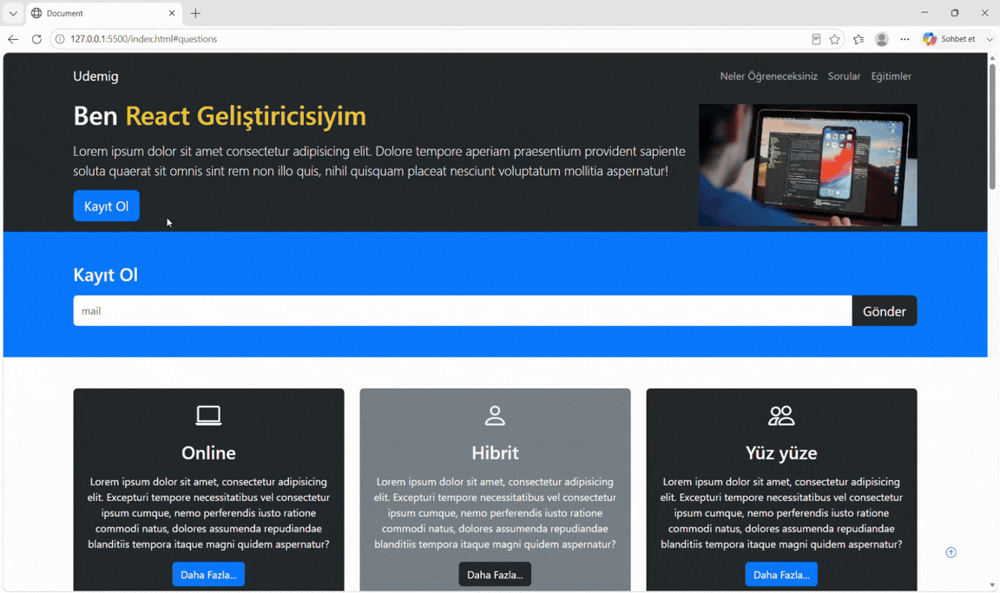

<h1>Udemig Project</h1>

Udemy Project is a responsive educational website developed using HTML, CSS, and Bootstrap.
The project focuses on creating a modern and user-friendly interface for an online education platform.

<h2>Technologies Used and Libraries Used</h2>

HTML5, CSS3, Bootstrap, Bootstrap Icons, Responsive Web Design

<h3>Technologies Used and Libraries Used</h3>

